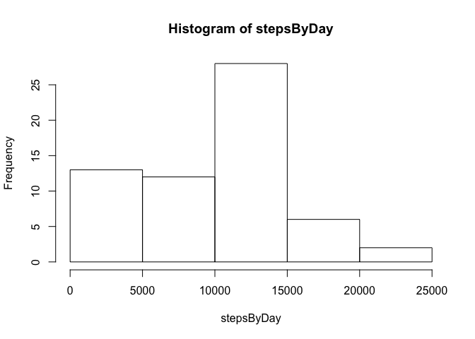
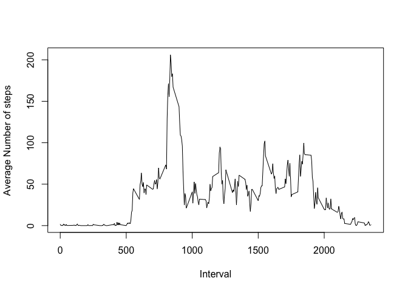
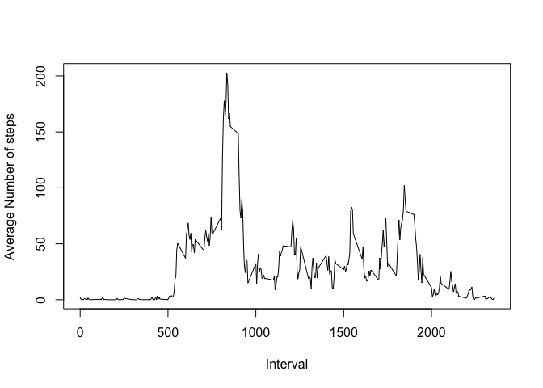
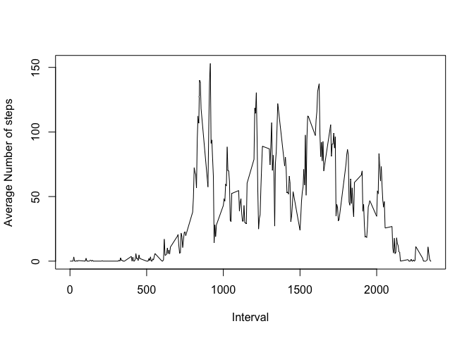

# Reproducible Research: Peer Assessment 1


## Loading and preprocessing the data


```r
data=read.csv("activity.csv")
```


## What is mean total number of steps taken per day?

Calculate the total number of steps taken per day

```r
stepsByDay=by(data,data$date,function(x) {sum(x["steps"],na.rm=TRUE)})
stepsByDay=do.call(rbind,as.list(stepsByDay))
meanStepsByDay=mean(stepsByDay[,1])
medianStepsByDay=median(stepsByDay[,1])
```


Plot a Histogram

```r
hist(stepsByDay)
```

 


Mean Total Steps By Day: 9354.2295082


Median Total Steps By Day: 10395


## What is the average daily activity pattern?


```r
intervals=do.call(rbind,as.list(by(data,data$interval,function(x) {data.frame(interval=unique(x[["interval"]]),meanSteps=mean(x[["steps"]],na.rm=TRUE))})))

plot(intervals$interval, intervals$meanSteps, type="l",xlab= "Interval", ylab= "Average Number of steps")
```

 

Which 5-minute interval, on average across all the days in the dataset, contains the maximum number of steps?


```r
maxInterval=intervals[order(intervals$meanSteps),][nrow(intervals),"interval"]
```

Answer: 835

## Imputing missing values

Note that there are a number of days/intervals where there are missing values (coded as NA). The presence of missing days may introduce bias into some calculations or summaries of the data.

    Calculate and report the total number of missing values in the dataset (i.e. the total number of rows with NAs)
    

```r
totalWithNAs=sum(is.na(data$steps))
```
ANSWER: 2304

    Devise a strategy for filling in all of the missing values in the dataset. The strategy does not need to be sophisticated. For example, you could use the mean/median for that day, or the mean for that 5-minute interval, etc.
    Create a new dataset that is equal to the original dataset but with the missing data filled in.


```r
dataNoNAs<-data
for (i in 1:nrow(data)) {
    if( is.na(data[i,"steps"]) ) {
      dataNoNAs[i,"steps"] <- stepsByDay[data[i,"date"]]
    }
}  
```

    
    Make a histogram of the total number of steps taken each day and Calculate and report the mean and median total number of steps taken per day. Do these values differ from the estimates from the first part of the assignment? What is the impact of imputing missing data on the estimates of the total daily number of steps?
    

```r
stepsByDay2=by(dataNoNAs,dataNoNAs$date,function(x) {sum(x["steps"])})
stepsByDay2=do.call(rbind,as.list(stepsByDay2))
meanStepsByDay2=mean(stepsByDay2[,1])
medianStepsByDay2=median(stepsByDay2[,1])
```

Plot a Histogram

```r
hist(stepsByDay2)
```

 


Mean Total Steps By Day: 9354.2295082

Median Total Steps By Day: 10395

It didn't have an impact, because all the NAs were in parts where steps were zero (results not shown for this but did the calculation aside)

## Are there differences in activity patterns between weekdays and weekends?

For this part the weekdays() function may be of some help here. Use the dataset with the filled-in missing values for this part.

    Create a new factor variable in the dataset with two levels – “weekday” and “weekend” indicating whether a given date is a weekday or weekend day.

    Make a panel plot containing a time series plot (i.e. type = "l") of the 5-minute interval (x-axis) and the average number of steps taken, averaged across all weekday days or weekend days (y-axis). See the README file in the GitHub repository to see an example of what this plot should look like using simulated data.

```r
dataNoNAs$typeOfDay <- ""
library(timeDate)
for (i in 1:nrow(dataNoNAs)) {
  if(isWeekday(dataNoNAs[i,"date"])) {
    dataNoNAs[i,"typeOfDay"]<-"weekday"
  } else {
    dataNoNAs[i,"typeOfDay"]<-"weekend"
  }
}

intervals=do.call(rbind,as.list(by(dataNoNAs,list(dataNoNAs$interval,dataNoNAs$typeOfDay),function(x) {data.frame(interval=unique(x[["interval"]]),typeOfDay=unique(x[["typeOfDay"]]),meanSteps=mean(x[["steps"]],na.rm=TRUE))})))
```


WEEKDAY

```r
weekdayIntervals <- intervals[intervals$typeOfDay=="weekday",]

plot(weekdayIntervals$interval, weekdayIntervals$meanSteps, type="l",xlab= "Interval", ylab= "Average Number of steps")
```

 

```r
#Initially I tried to do the following but did not work
#library(ggplot2)
#intervals$typeOfDay<- factor(intervals$typeOfDay)
#ggplot(data=intervals,aes(x=interval,y=meanSteps))+geom_line()+facet_wrap(~typeOfDay)
```


WEEKEND

```r
weekendIntervals <- intervals[intervals$typeOfDay=="weekend",]

plot(weekendIntervals$interval, weekendIntervals$meanSteps, type="l",xlab= "Interval", ylab= "Average Number of steps")
```

 


